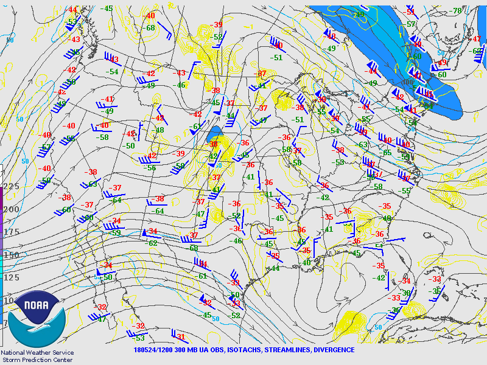

May 24th, 2018 Case Study
"""""""""""""""""""""""""

Global/Synoptic
===============
* At 300mb, the area of interest is located in 

* There is no advection present. 

Mesoscale
===============
* There is no frontal movement for the area of interest.
* The air in northeastern OK was saturated, which aided in the formation of cells later in the day.

Site
===============
* Convection occurred mainly in the afternoon (around 4pm, with the first cells forming around 2pm) into the evening.
* Convection was driven by lift driven by diurnal cooling. 
